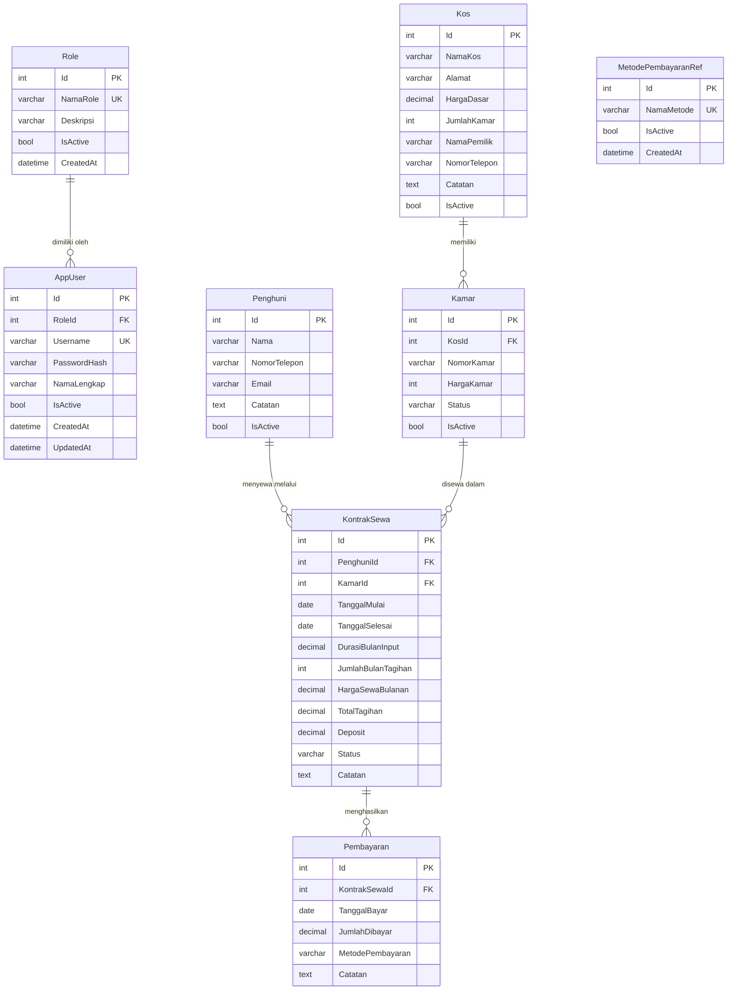
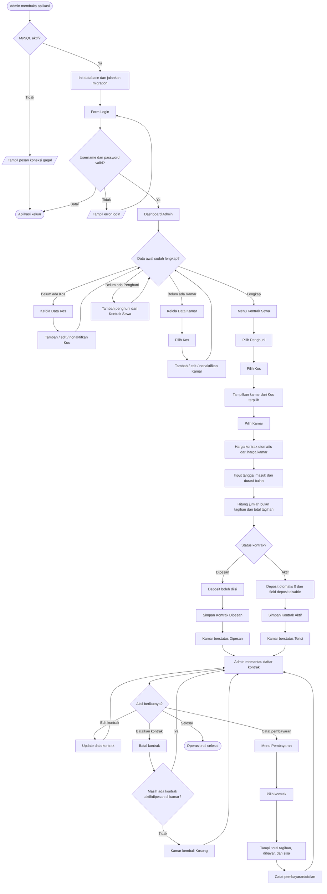

# Diagram Aplikasi Management KOS

## 1. ERD (Entity Relationship Diagram)

Catatan:

- `AppUser` adalah akun admin/operator yang boleh masuk aplikasi.
- `Role` dan `MetodePembayaranRef` adalah data reference.
- `Kos`, `Kamar`, dan `Penghuni` adalah data master.
- `KontrakSewa` dan `Pembayaran` adalah data transaksi.
- `Penghuni` tidak lagi menentukan kamar langsung. Penghuni baru mendapatkan kamar saat admin membuat `KontrakSewa`.
- Satu penghuni dapat menyewa lebih dari satu kamar karena relasi kamar disimpan di `KontrakSewa`.
- Durasi kontrak diinput sebagai jumlah bulan; nilai pecahan dibulatkan ke atas untuk tagihan.
- Pembayaran dicatat terpisah dan dapat dilakukan berkali-kali untuk satu kontrak.
- Harga sewa kontrak mengambil `Kamar.HargaKamar`, bukan input manual di form kontrak.
- Data user dan master memakai soft delete melalui `IsActive`.

---

## 2. Flowchart POV Admin

