# Diagram Aplikasi Management KOS

## 1. ERD (Entity Relationship Diagram)

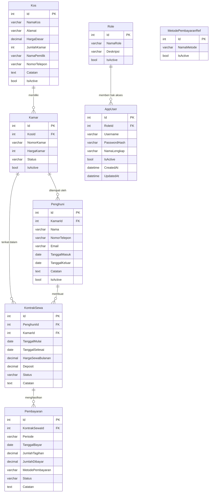

### Catatan Normalisasi dan Requirement Basis Data

- `Role` dan `MetodePembayaranRef` adalah tabel reference.
- `AppUser` adalah tabel user/autentikasi.
- `Kos`, `Kamar`, dan `Penghuni` adalah data master.
- `KontrakSewa` dan `Pembayaran` adalah data transaksi.
- Data user dan master memakai soft delete melalui `IsActive`, bukan hapus fisik.
- Trigger database pada `KontrakSewa` menjaga sinkronisasi dasar ke `Kamar.Status` saat `INSERT`, `UPDATE`, dan `DELETE`.

---

## 2. Sequence Diagram

### 2.1 Tambah Kos

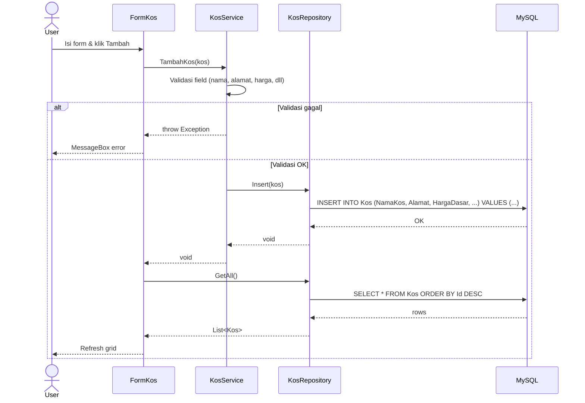

### 2.2 Tambah Kamar

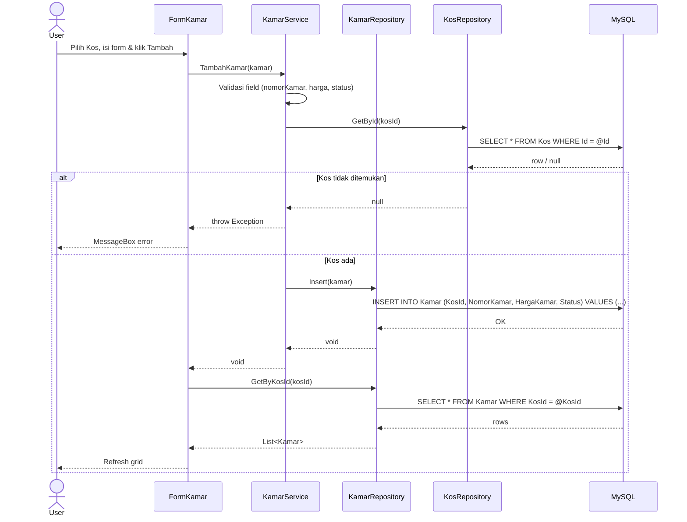

### 2.3 Tambah Penghuni

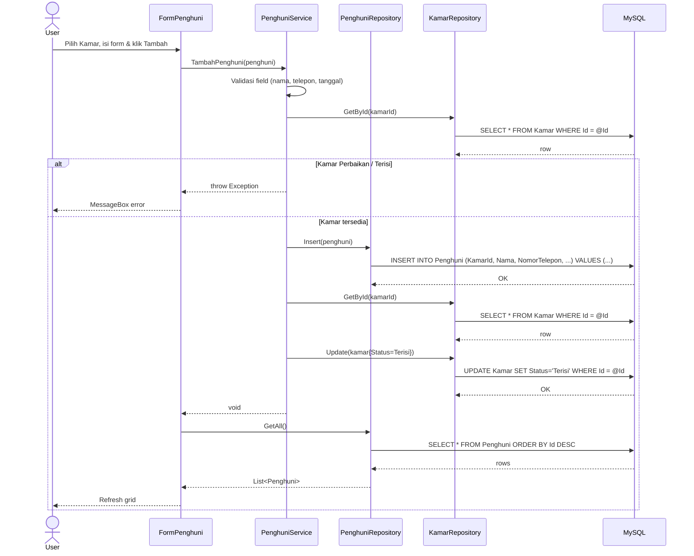

### 2.4 Hapus Penghuni

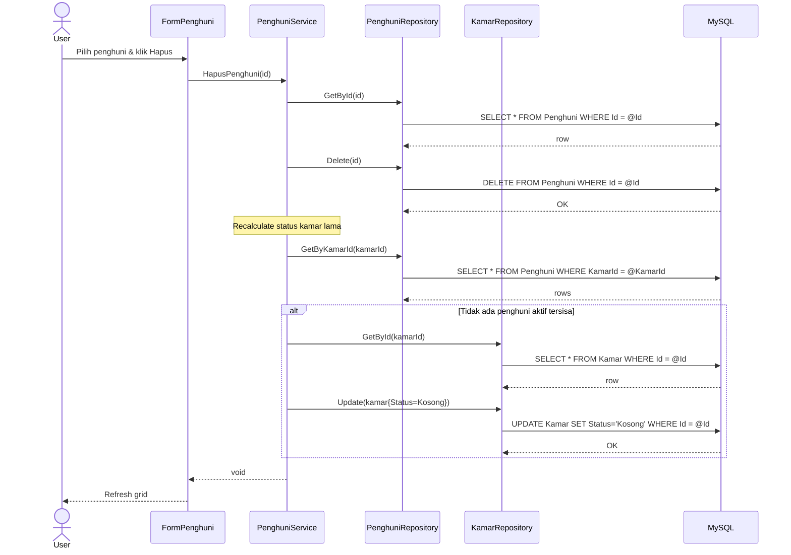

### 2.5 Tambah Kontrak Sewa

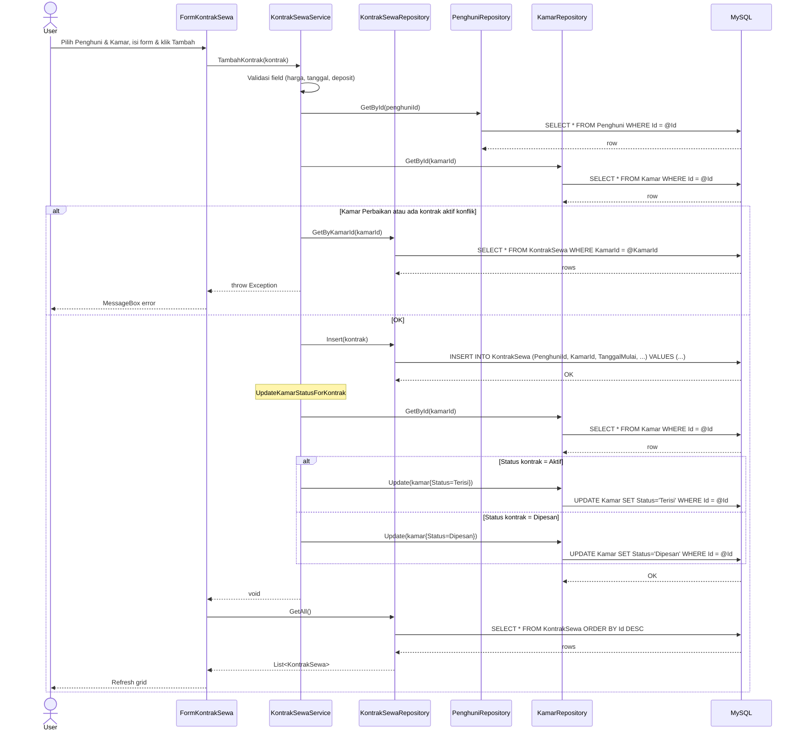

### 2.6 Selesaikan / Batalkan Kontrak Sewa

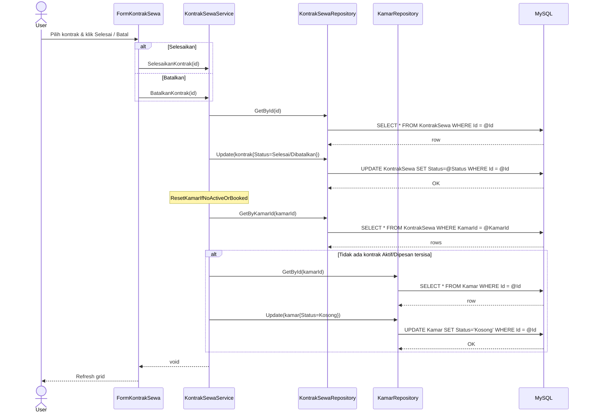

### 2.7 Tambah Tagihan Pembayaran

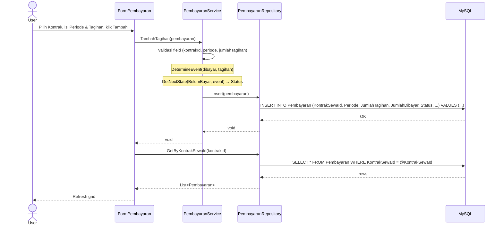

### 2.8 Bayar Tagihan

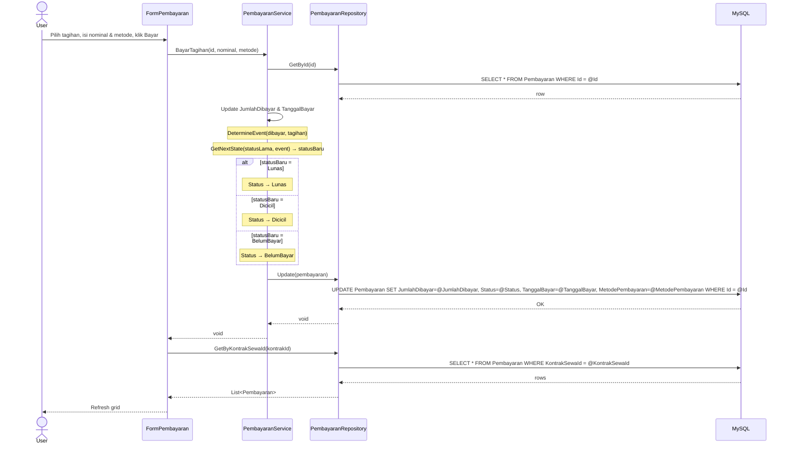

---

## 3. Flowchart Alur Aplikasi

---

## 3. State Diagram: Status Kamar

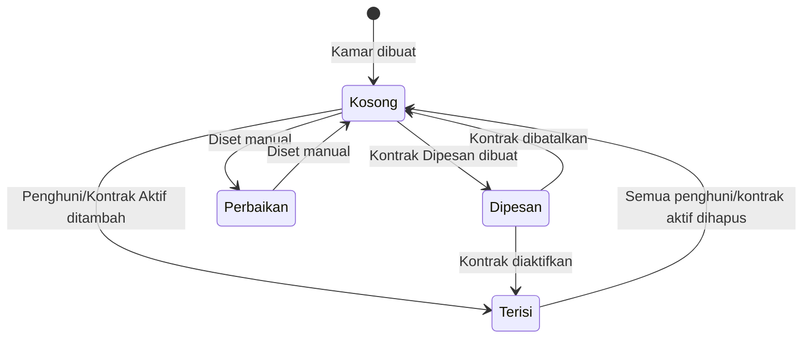

---

## 4. State Diagram: Status Pembayaran

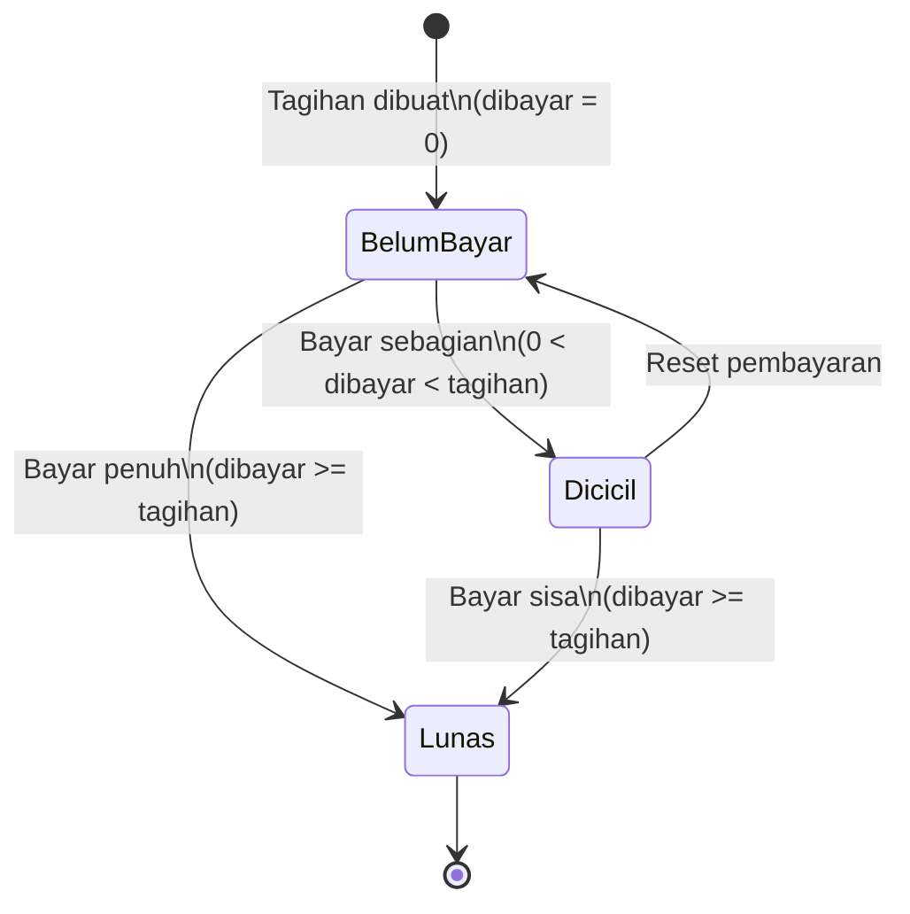
