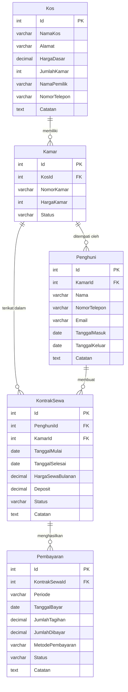
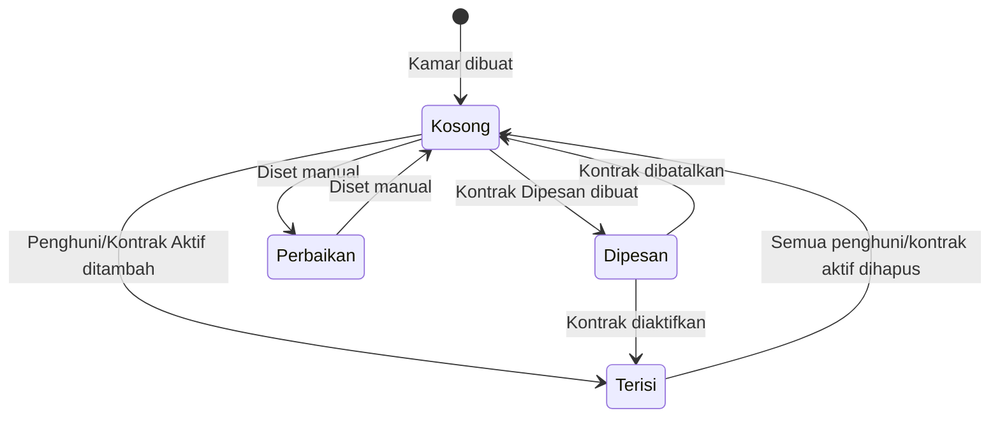
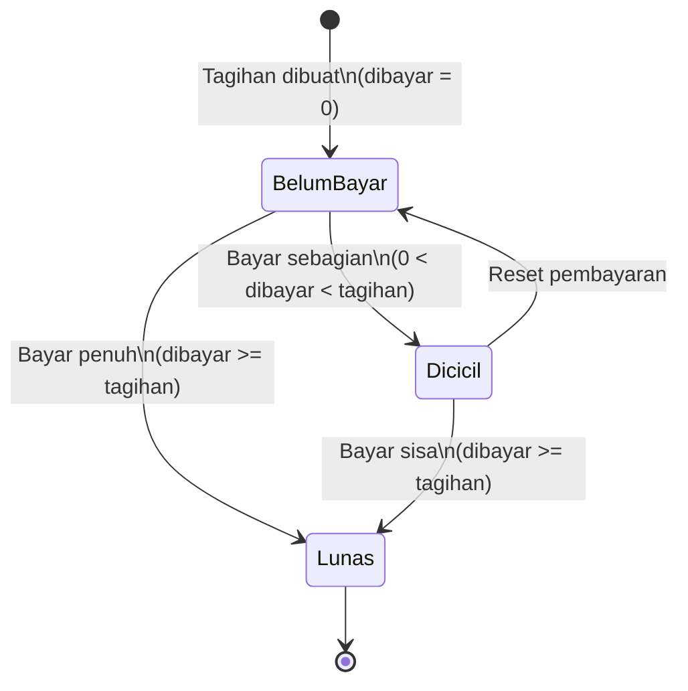

# Diagram Aplikasi Management KOS

## 1. ERD (Entity Relationship Diagram)

---

## 2. Flowchart Alur Aplikasi

```mermaid
flowchart TD
    START([Aplikasi Start]) --> CEK_DB{MySQL aktif?}
    CEK_DB -- Tidak --> ALERT[/Alert: Koneksi Gagal/]
    ALERT --> EXIT([Aplikasi Keluar])
    CEK_DB -- Ya --> INIT[Init Database & Migrasi]
    INIT --> MAIN[FormMain - Dashboard]

    MAIN --> M_KOS[Menu: Data Kos]
    MAIN --> M_KAMAR[Menu: Data Kamar]
    MAIN --> M_PENGHUNI[Menu: Data Penghuni]
    MAIN --> M_KONTRAK[Menu: Kontrak Sewa]
    MAIN --> M_BAYAR[Menu: Pembayaran]

    %% ── MODUL KOS ──
    M_KOS --> KOS_LIST[Tampil Daftar Kos]
    KOS_LIST --> KOS_TAMBAH[Tambah Kos]
    KOS_LIST --> KOS_EDIT[Edit Kos]
    KOS_LIST --> KOS_HAPUS[Hapus Kos]
    KOS_TAMBAH & KOS_EDIT --> KOS_VALID{Validasi}
    KOS_VALID -- Gagal --> KOS_ERR[/Tampil Error/]
    KOS_VALID -- OK --> KOS_SAVE[Simpan ke DB]
    KOS_SAVE --> KOS_LIST

    %% ── MODUL KAMAR ──
    M_KAMAR --> KAM_LIST[Tampil Daftar Kamar per Kos]
    KAM_LIST --> KAM_TAMBAH[Tambah Kamar]
    KAM_LIST --> KAM_EDIT[Edit Kamar]
    KAM_LIST --> KAM_HAPUS[Hapus Kamar]
    KAM_TAMBAH & KAM_EDIT --> KAM_VALID{Validasi}
    KAM_VALID -- Gagal --> KAM_ERR[/Tampil Error/]
    KAM_VALID -- OK --> KAM_SAVE[Simpan ke DB]
    KAM_SAVE --> KAM_LIST

    %% ── MODUL PENGHUNI ──
    M_PENGHUNI --> PEN_LIST[Tampil Daftar Penghuni]
    PEN_LIST --> PEN_TAMBAH[Tambah Penghuni]
    PEN_LIST --> PEN_EDIT[Edit Penghuni]
    PEN_LIST --> PEN_HAPUS[Hapus Penghuni]

    PEN_TAMBAH --> PEN_VALID{Validasi}
    PEN_VALID -- Gagal --> PEN_ERR[/Tampil Error/]
    PEN_VALID -- OK --> PEN_CEK{Kamar\ntersedia?}
    PEN_CEK -- Tidak --> PEN_ERR
    PEN_CEK -- Ya --> PEN_SAVE[Simpan Penghuni]
    PEN_SAVE --> UPDATE_KAM1[Kamar → Terisi]
    UPDATE_KAM1 --> PEN_LIST

    PEN_HAPUS --> PEN_DEL[Hapus Penghuni]
    PEN_DEL --> CEK_AKT1{Masih ada\npenghuni aktif\ndi kamar?}
    CEK_AKT1 -- Tidak --> UPDATE_KAM2[Kamar → Kosong]
    CEK_AKT1 -- Ya --> PEN_LIST
    UPDATE_KAM2 --> PEN_LIST

    %% ── MODUL KONTRAK ──
    M_KONTRAK --> KON_LIST[Tampil Daftar Kontrak]
    KON_LIST --> KON_TAMBAH[Tambah Kontrak]
    KON_LIST --> KON_EDIT[Edit Kontrak]
    KON_LIST --> KON_SELESAI[Selesaikan Kontrak]
    KON_LIST --> KON_BATAL[Batalkan Kontrak]
    KON_LIST --> KON_HAPUS[Hapus Kontrak]

    KON_TAMBAH --> KON_VALID{Validasi}
    KON_VALID -- Gagal --> KON_ERR[/Tampil Error/]
    KON_VALID -- OK --> KON_CEK{Konflik\nkontrak\naktif?}
    KON_CEK -- Ada --> KON_ERR
    KON_CEK -- Tidak --> KON_SAVE[Simpan Kontrak]
    KON_SAVE --> KON_STATUS{Status\nKontrak?}
    KON_STATUS -- Aktif --> UPDATE_KAM3[Kamar → Terisi]
    KON_STATUS -- Dipesan --> UPDATE_KAM4[Kamar → Dipesan]
    UPDATE_KAM3 & UPDATE_KAM4 --> KON_LIST

    KON_SELESAI --> KON_SEL_SAVE[Status → Selesai]
    KON_BATAL --> KON_BAT_SAVE[Status → Dibatalkan]
    KON_SEL_SAVE & KON_BAT_SAVE --> CEK_AKT2{Masih ada\nkontrak aktif\ndi kamar?}
    CEK_AKT2 -- Tidak --> UPDATE_KAM5[Kamar → Kosong]
    CEK_AKT2 -- Ya --> KON_LIST
    UPDATE_KAM5 --> KON_LIST

    %% ── MODUL PEMBAYARAN ──
    M_BAYAR --> BAY_LIST[Tampil Daftar Tagihan per Kontrak]
    BAY_LIST --> BAY_TAMBAH[Tambah Tagihan]
    BAY_LIST --> BAY_BAYAR[Bayar Tagihan]
    BAY_LIST --> BAY_HAPUS[Hapus Tagihan]

    BAY_TAMBAH --> BAY_VALID{Validasi}
    BAY_VALID -- Gagal --> BAY_ERR[/Tampil Error/]
    BAY_VALID -- OK --> BAY_AUTO[Auto-hitung Status]
    BAY_AUTO --> BAY_LIST

    BAY_BAYAR --> INPUT_NOM[Input Nominal & Metode]
    INPUT_NOM --> BAYAR_HITUNG{JumlahDibayar\nvs Tagihan}
    BAYAR_HITUNG -- = 0 --> ST_BELUM[Status → BelumBayar]
    BAYAR_HITUNG -- Sebagian --> ST_CICIL[Status → Dicicil]
    BAYAR_HITUNG -- Lunas --> ST_LUNAS[Status → Lunas]
    ST_BELUM & ST_CICIL & ST_LUNAS --> BAY_LIST
```

---

## 3. State Diagram: Status Kamar

---

## 4. State Diagram: Status Pembayaran

